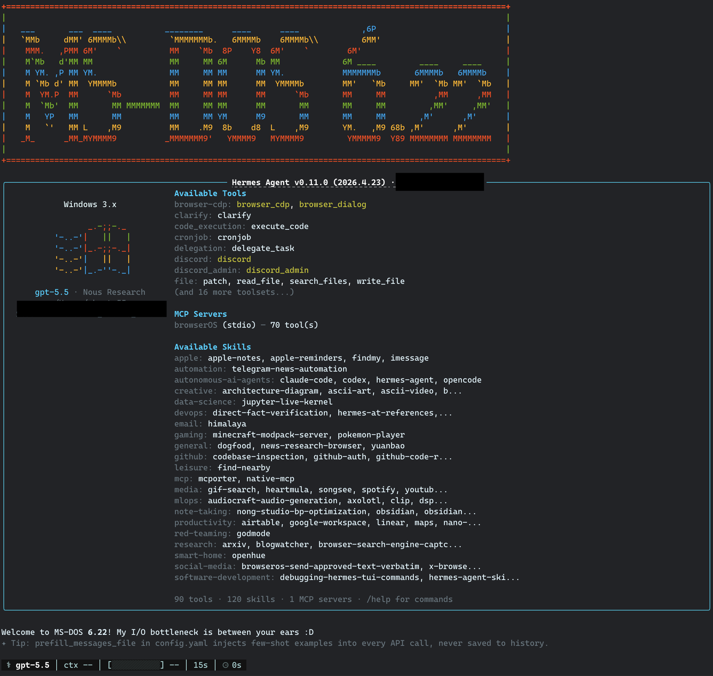

# Hermes Ghost Theme

A custom Hermes Agent CLI/TUI theme with two variants: `mono-ghost` and `mono-ghost-tui`.

It is a dark, high-contrast terminal skin with cyan accents, a retro MS-DOS / Windows 3.x banner, and minimal spinner styling.

## Preview



## Files

```text
skins/mono-ghost.yaml
skins/mono-ghost-tui.yaml
assets/preview.png
```

### `skins/mono-ghost.yaml`

The original Hermes Agent skin file.

Best for the classic CLI view or terminals where Rich markup in the banner renders correctly. It keeps the more colorful Windows 3.x hero art.

### `skins/mono-ghost-tui.yaml`

The TUI-safe variant.

Best for Hermes TUI usage when the original Rich-markup hero can wrap, misalign, or render inconsistently. It keeps the same color palette, spinner, branding, and tool styling, but replaces the hero with fixed-width ASCII art for more stable layout.

Both files configure:

- `colors`: CLI banner, prompt, response border, status bar, completion menu, warnings, and error colors.
- `spinner`: waiting / thinking indicators and verbs.
- `branding`: agent welcome text, goodbye text, response label, prompt symbol, and help header.
- `tool_prefix`: prefix used before tool activity lines.
- `tool_emojis`: per-tool emoji overrides. Currently empty.
- `banner_logo`: custom Rich-markup ASCII logo.
- `banner_hero`: Windows 3.x style hero art; colorful Rich markup in `mono-ghost`, fixed-width ASCII in `mono-ghost-tui`.

The preview image shows the theme running in Hermes Agent.

## Install

Copy the skin file you want into your Hermes skins directory:

```bash
mkdir -p ~/.hermes/skins
cp skins/mono-ghost.yaml ~/.hermes/skins/mono-ghost.yaml
# or, for the TUI-safe variant:
cp skins/mono-ghost-tui.yaml ~/.hermes/skins/mono-ghost-tui.yaml
```

Then activate one inside Hermes:

```text
/skin mono-ghost
# or:
/skin mono-ghost-tui
```

To make one your default theme:

```bash
hermes config set display.skin mono-ghost
# or:
hermes config set display.skin mono-ghost-tui
```

Restart Hermes after changing the default config.

## Follow me on Twitter

- [@ghosTM55](https://x.com/ghostm55)

## License

This project is source-available for non-commercial use under the
PolyForm Noncommercial License 1.0.0.

Commercial use is not permitted without separate written permission.
